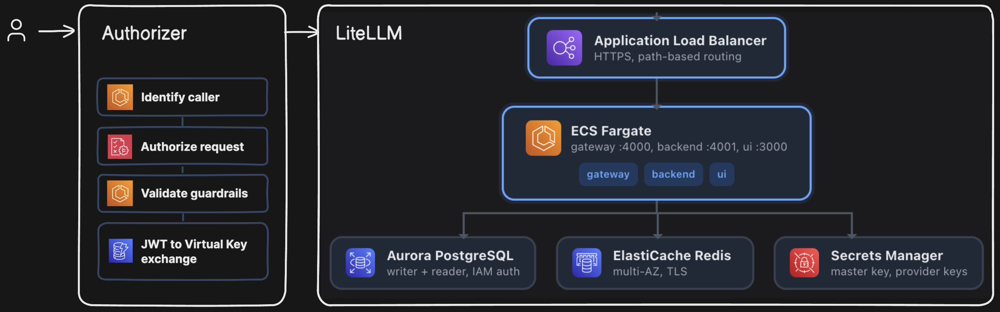

# AI Gateway Initial Proposal

## Contents

- [1. Intro](#1-intro)
- [2. Approach](#2-approach)
- [3. Requirements](#3-requirements)
- [4. High-Level Design](#4-high-level-design)
  - [4.1. LiteLLM (Core)](#41-litellm-core)
  - [4.2. Authorizer](#42-authorizer)
- [5. Design Alternatives](#5-design-alternatives)
- [6. Out of scope](#6-out-of-scope)

## 1. Intro

An AI gateway is essential infrastructure component for companies of all sizes that run multiple LLM-powered applications. These applications typically have common non-functional requirements such as the ability to run different models, track user spending and enforcing budgets. Without a common gateway, each team must either build its own implementation—duplicating effort and often producing several incomplete solutions—or invest in a centralized, well-designed solution that is generic and expressive enough to support every current and future application in the team's or organization's catalog.

This project takes the second approach, using LiteLLM, a popular AI gateway,
as baseline and extends it to fill key gaps.

## 2. Approach

There are various AI Gateway solutions out there, from SaaS to open-source distributions, all of which consistently fail to capture the complete set of features your team needs. Nevertheless, open-source solutions often provide a strong foundation that teams can extend to address critical feature gaps. This approach avoids spending weeks reinventing a solution that other teams with millions in VC funding have already built and battle-tested.

## 3. Requirements

I consider the following minimum acceptance criteria for a complete AI Gateway:

- Unified LLM API Interface
- HTTP and SSE transports
- Native deployment on at least one of the three major hyperscalers: AWS
  (preferred), Azure, or GCP
- A multi-tenant model that tracks usage and enforces cost controls with
  hierarchies at least one level deep (e.g., User -> Team)
- Built-in logs and traces

The following are nice-to-have capabilities but not grounds for immediate exclusion, either because they (a) can be built and run separately from the gateway or (b) provide alternatives to the core feature set.

- Guardrails
- WebSocket transport - OpenAI popularized it as an efficient alternative to
  SSE, particularly for high-volume conversations. It is deferred because
  HTTP and SSE cover the required flows. The ALB-based architecture supports
  adding WebSocket pass-through later.
- JWT authentication
- Credential load balancing - Distributes traffic across available
  provider keys using real-time metrics, load-balancing algorithms and other
  techniques.

## 4. High-Level Design

A request moves through the gateway as follows:

1. The **client** sends its request and JWT to the public gateway ALB.
2. The **gateway ALB** forwards the request to the authorizer.
3. The **authorizer** validates the JWT, evaluates permissions against Amazon Verified Permissions, and applies pre-flight guardrails.
4. The authorizer exchanges the validated identity for a short-lived LiteLLM
   virtual key and forwards the request.
5. **LiteLLM** applies its routing and guardrails, records spend against the
   user and team budgets, and calls the selected **model provider**.
6. The response returns to the client through the same path.

LiteLLM remains the source of truth for spend, budgets, and model routing.

### 4.1. LiteLLM (Core)

With more than 53,000 GitHub stars, LiteLLM is arguably the most popular open-source AI gateway with major tech companies including Netflix, Stripe, and SAP, as references.

Its recent Rust migration (mid-2026) addresses previous performance concerns about its Python-based implementation (FastAPI). Those concerns led competitors such as Bifrost to claim performance up to 50 times faster than LiteLLM.

Post-migration, LiteLLM reported metrics describe a stable throughput increased by 15x (450 -> 6,700 RPS) while cutting request overhead by 99%, from 7.5ms to 0.05ms. This throughput surpasses Bifrost's documented 5,000 stable RPS, although Bifrost reports an overall lower request overhead of approximately 0.011 ms.

#### Deployment

LiteLLM makes AWS deployment straightforward by providing a Terraform module
for production deployments on EKS and ECS.

#### Multi-tenancy

> **Fit:** native

LiteLLM supports multi-tenant architectures across organizations, teams, departments, and customers while maintaining appropriate isolation between tenants. The OSS version does not support organizations, so teams form its highest hierarchy level, though this shouldn't be a problem for most startups and medium-size scale-ups.

Team membership is optional. When the configured JWT team claim is present,
the gateway attributes the LiteLLM virtual key to both the user and team.
Without the claim, it attributes the key only to the user, allowing solo
developers to use the gateway without a synthetic team.

Administrators provision teams so budgets and model allowlists remain under
their control. The gateway never creates teams from token claims and rejects
unknown team identifiers with `403 team_not_provisioned`.

#### Authentication

> **Fit:** requires custom work

Authentication is based on virtual keys, which conceptually behave similarly to API Keys. A user can have multiple virtual keys.

JWT-based auth for OIDC identities, and consequently JWT -> Virtual Key mapping, is only available in Enterprise versions.

#### Load Balancing

> **Fit:** native

LiteLLM provides multiple load-balancing algorithms and an experimental
automatic-routing feature that selects models based on request complexity.

#### Authorization

> **Fit:** requires custom work

Although LiteLLM offers RBAC controls in its Enterprise distribution, but they lack the
expressiveness that most production applications need for flexible permission
models.

#### Deployment

> **Fit:** native

LiteLLM provides pre-built Terraform modules that simplify deployment, breaking with the long-standing OSS convention of supporting Kubernetes deployments only. Its native AWS, Azure, and GCP deployment options are a welcome alternative for teams that want to avoid Kubernetes and its inherent complexity.

#### Guardrails

> **Fit:** native

LiteLLM-native guardrails configured through `proxy_config` are the primary
mechanism. The authorizer retains a pluggable pre-flight `Guardrail` interface
for checks that must run before LiteLLM, with no pre-flight guardrails
registered by default.

#### Client integrations

LiteLLM exposes OpenAI-compatible HTTP endpoints from which teams can generate client SDKs in their preferred programming languages by using tools such as Speakeasy, Stainless, or Fern.

### 4.2. Authorizer

The authorizer runs as a discrete process that validates and authorizes each request before passing it to LiteLLM:

1. Extracts the `Authorization` request header to identify and validate the caller (expects a valid JWT)
2. Checks the decoded identity and request details against Amazon Verified Permissions to determine whether the caller can perform the request
3. Passes the request through any registered pre-flight guardrails
4. Maps the caller's JWT to one or more virtual keys for authenticated LiteLLM requests
5. Sends the request to LiteLLM with the mapped virtual keys

#### Identity and authentication

The gateway accepts JWTs from an external, standards-compliant OIDC issuer.

Gateway owners configure the issuer and audience through `OIDC_ISSUER_URL` and
`OIDC_AUDIENCE`; the authorizer loads signing keys through OIDC discovery.

The gateway does not provision any Idp (such as Amazon Cognito) or assume responsibility for user lifecycle management.

#### Authorization

The authorizer verifies JWTs locally with `jose`, constructs the principal and
related entities from validated claims, and calls Amazon Verified Permissions
`IsAuthorized`.

Alternatively, we can validate the JWT and authorize the request in a single remote call to Amazon Verified Permissions using `IsAuthorizedWithToken` against a configured AVP OIDC identity source - useful if policies reference specific token claims.

Both options are valid. First option keeps token validation and claim mapping explicit and is the only choice if you need to trust multiple IdPs.

**Note:** Introducing another service fragments authorization responsibilities
between the custom authorizer (JWTs and application-level checks) and LiteLLM
(virtual keys and budgets).

## 5. Design Alternatives

### vs Bifrost

- Provides weighted credential load balancing out of the box
- Supports ECS deployment, although it requires hand-rolling the infrastructure code since Bifrost does not provide any prebuilt Terraform modules
- Uses basic authentication but supports custom JWT authentication on top of
  virtual keys
- Includes semantic caching out of the box
- Its official documentation reports a maximum throughput of 3,000–5,000 RPS
- Includes Prometheus metrics endpoints for telemetry data
- Implements usage and budgets at user and team level

Despite this, Bifrost's guardrails framework is only available to the Enterprise version, therefore teams using the OSS version must craft a Go plugin to implement custom guardrails. This became a deciding factor and why we I've ultimately excluded Bifrost in favour of LiteLLM.

### vs PortKey

Excluded Portkey because its OSS distribution lacks key features that
require an Enterprise license:

- Multi-tenancy at any team/org level
- Observability

### vs Kong

Excluded Kong because it restricts deployment to Kubernetes, which offers
less flexibility than simpler container orchestration services such as ECS - EKS Auto Mode wasn't evaluated as a possible alternative.

### vs SaaS

Excluded Cloudflare AI Gateway, Vercel AI Gateway, and OpenRouter because
they do not meet the open-source requirement.

---

## 6. Out of scope

At the time of writing, we excluded the following capabilities from the
project's scope:

- Simple caching
- Semantic caching
- Routing rules
- Automatic fallbacks
- Automatic retries
- Prompt management
- WebSocket transport
