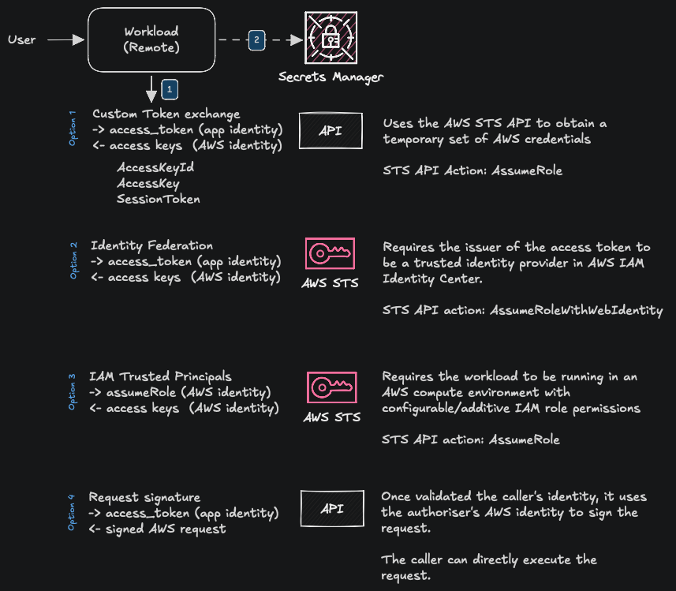

# AWS Request SigV4

Authenticate requests to AWS API's.

> The diagram above showcases multiple ways to implement programmatic authentication to AWS APIs. Though not all options are implemented in this repo, the concepts in the diagram should be enough to draft a working solution for your use case with minimal effort.

The proof of identity sent over to the exchange can be either user-scoped (caller identity propagation) or global (app identity). Both can be considered secure though user-scoped identity provides advantages such as smaller blast radius (in case access tokens get compromised) and more granular access control.
