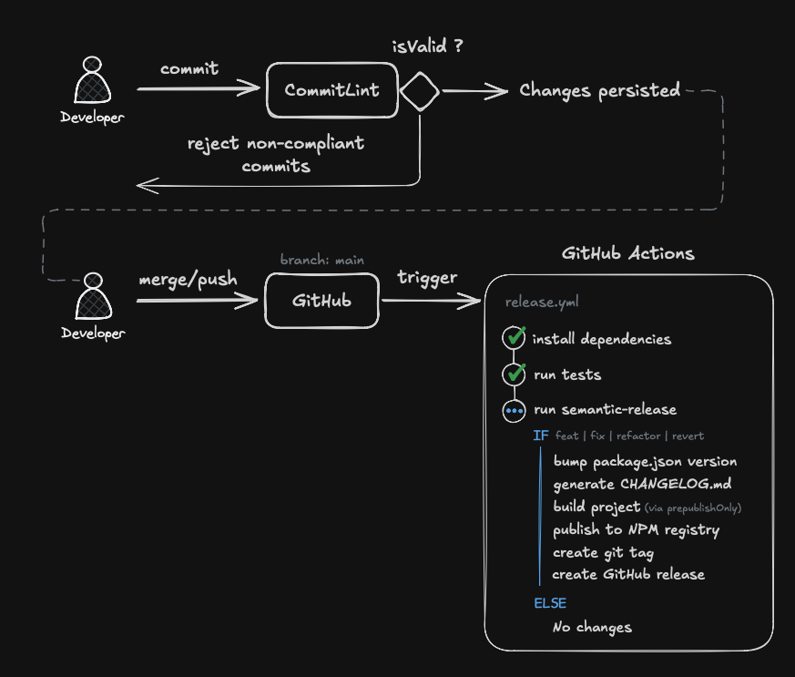

# NPM Publishing Reference



This document prescribes a workflow reference to **automate** the processes of building, versionining and distributing NPM packages using two generally accepted conventions:

- **Conventional Commits** - for standardized commit messages
- **Semantic Versioning (SemVer)** - for version numbers

## Table of Contents

- [Release workflow](#release-workflow)
- [Configuration Reference](#configuration-reference)
- [Versioning Rules](#versioning-rules)
- [GitHub Packages (Current Setup)](#github-packages-current-setup)
- [Public npm Registry (Alternative)](#public-npm-registry-alternative)
- [Manual Publishing](#manual-publishing)

## Release workflow

Publishing is **fully automated** triggered when a developer pushes/merges changes to main. There is no manual version bump or manual `npm publish` step in the workflow.

1. **Commit** — locally validates message format via commitlint (`.husky/commit-msg`).
   If the format is invalid, the commit is rejected with helpful error messages.
2. **Merge to `main`** — triggers `.github/workflows/release.yml`.
3. **Install & test** — `npm clean-install`, then `npm run test:run`.
4. **semantic-release** — analyzes commits since the last release tag.
5. **If a release is warranted**:
   - Bumps `package.json` / `package-lock.json` version
   - Regenerates `CHANGELOG.md`
   - Runs `prepublishOnly` (`npm run build`)
   - Publishes to the configured registry
   - Commits release assets with message `chore(release): X.Y.Z [skip ci]`
   - Creates git tag `vX.Y.Z`
   - Creates a GitHub Release with generated notes

The `[skip ci]` suffix on the release commit prevents an infinite release loop.

## Configuration Reference

### Tools

| Concern            | Tool                                                                      |
| ------------------ | ------------------------------------------------------------------------- |
| Commit format      | [Conventional Commits](https://www.conventionalcommits.org/) + commitlint |
| Version numbers    | [Semantic Versioning (SemVer)](https://semver.org/) (SemVer)              |
| Release automation | [semantic-release](https://semantic-release.gitbook.io/)                  |

### `package.json`

```json
{
  "name": "@your-org/ai-sdk",
  "publishConfig": {
    "registry": "https://npm.pkg.github.com" // target registry URL for `npm publish`
  },
  "files": ["dist"], // Compiled output to be included in the tarball
  "main": "dist/index.js", // primary entry point to your package
  "types": "dist/index.d.ts", // entrypoint to the bundled declaration file.
  "module": "dist/index.js", // ECMAScript compatible package entrypoint
  "exports": {
    // restrict exported files
    ".": {
      "types": "./dist/index.d.ts",
      "import": "./dist/index.js",
      "require": "./dist/index.js",
      "default": "./dist/index.js"
    }
  },
  "scripts": {
    "build": "rm -rf dist && tsc",
    "prepublishOnly": "npm run build",
    "test": "vitest",
    "test:run": "vitest run"
  }
}
```

When the repository is owned by an organization, it is required to scope the package to the GitHub organization in order for GitHub Packages to work correctly, e.g.

### `.releaserc.json`

`semantic-release` uses these plugins in the following order:

| Plugin                                      | Purpose                                                                                                |
| ------------------------------------------- | ------------------------------------------------------------------------------------------------------ |
| `@semantic-release/commit-analyzer`         | (Pre-installed) Maps commit types to version bumps                                                     |
| `@semantic-release/release-notes-generator` | (Pre-installed) Generates changelong content with conventional-changelog                               |
| `@semantic-release/changelog`               | Writes releases notes into a `CHANGELOG.md` file                                                       |
| `@semantic-release/npm`                     | (Pre-installed) Enables publishing npm packages                                                        |
| `@semantic-release/git`                     | Allows pushing back the released `package.json`, `package-lock.json`, `CHANGELOG.md` to the repository |
| `@semantic-release/github`                  | (Pre-installed) Creates GitHub Release                                                                 |

See [Plugins](https://semantic-release.org/foundation/plugins/) for more details.

### `.github/workflows/release.yml`

See [`.github/workflows/release.yml`](./.github/workflows/release.yml) for more details.

## Versioning Rules

Version numbers follow the **SemVer** spec(`MAJOR.MINOR.PATCH`). The release version
is derived entirely from commit messages since the last git tag — never set
manually.

### Commit type → version bump

| Commit type                | Version bump | Example transition |
| -------------------------- | ------------ | ------------------ |
| `feat`                     | **MINOR**    | `1.4.1` → `1.5.0`  |
| `fix`                      | **PATCH**    | `1.4.1` → `1.4.2`  |
| `refactor`                 | **PATCH**    | `1.4.1` → `1.4.2`  |
| `revert`                   | **PATCH**    | `1.4.1` → `1.4.2`  |
| `BREAKING CHANGE:` in body | **MAJOR**    | `1.4.1` → `2.0.0`  |
| `docs`                     | None         | —                  |
| `test`                     | None         | —                  |
| `build`                    | None         | —                  |
| `ci`                       | None         | —                  |
| `chore`                    | None         | —                  |

### Breaking Changes

When you need to signal breaking changes, include `BREAKING CHANGE:` in the commit body.

**Example:**

```
feat(llm-router): change initialization

BREAKING CHANGE: Router now requires a config object instead of using defaults.
```

### Reverting Changes

The conventional commits spec doesn't provide explicit guidelines for handling rollbacks, therefore I've filled in that gap with an opinionated approach based on a rollforward approach. In practice, this means the next set of changes reverting previous changes should be treated as a PATCH version bump.

That said, another viable approach would be to use a custom workflow that identifies `revert` commit prefix messages and runs `git revert` or `git reset` commands to effectively rollback the commit history.

**Example:**

```sh
# Developer
git commit -m "revert: let us never again speak of the noodle incident

Refs: latest" # or use specifics refs, e.g. 0d1d7fc32

# GitHub Actions (rollback.yml)
git revert HEAD~1
# git reset --hard 0d1d7fc32 # When using refs
```

References: https://www.conventionalcommits.org/en/v1.0.0/#how-does-conventional-commits-handle-revert-commits

### Precedence when multiple commits land in one release

`semantic-release` picks the **highest** applicable bump across all releasable
commits since the last tag:

- Any `BREAKING CHANGE` → **MAJOR**
- Else any `feat` → **MINOR**
- Else any `fix`, `perf`, `refactor`, or `revert` → **PATCH**

**Examples:**

| Commits since last tag            | Resulting bump |
| --------------------------------- | -------------- |
| 2× `fix`, 1× `docs`               | PATCH          |
| 2× `fix`, 1× `feat`, 3× `docs`    | MINOR          |
| 1× `feat` with `BREAKING CHANGE:` | MAJOR          |

---

## Usage (Consumers)

1. Create or update your `.npmrc`:

   ```ini
   @your-org:registry=https://npm.pkg.github.com
   //npm.pkg.github.com/:_authToken=${NPM_AUTH_TOKEN}
   ```

2. export `NPM_AUTH_TOKEN` env var using a GitHub PAT with `read:packages` permissions (and SSO authorized if applicable).

---

## Appendix

### GitHub Enterprise

When your repositories are hosted on GitHub Enterprise, the NPM registry uses the following domain: `npm.your-org.ghe.com`

### Motivation

Some engineers may never have to concern themselves with publishing or maintaining packages. This document is not for them. However, for the ones that have that responsibility - be it through an open source project; or a package you maintain that is internally used by your team or your organization - distribution becomes an important part of your work as others depend on it.

The importance of using communicating package changes through versions is beyond this document and is much more well explained in the SemVer specification, but can be ultimately summed up to having a common taxonomy of package versions between package producers and consumers.

Instead, I want to focus on why I and so many other colleagues I've worked it, believe that the process of publishing packages is so important to be as _frictionless_ and _predictable_ as possible.

The first and most sounding for me was always time. Maintaining a specific package was never my full-time job. In fact, often what would happen is I would build a stable version of a package and don't touch it for 6 months. However, whenever I needed to add a new feature or fix a bug, having to do a knowledge refresh of the steps I needed to to release a change of 5 lines of code felt like a waste of my time.

I wanted something simpler and less mentally taxing. Instead of,

```sh
git commit -m "
git tag
git push --tags
(Go to GitHub -> Publish Package/Run Workflow)
```

Why can't we just:

```sh
git commit -m "feat: this is a fix"
git push
```

The second approach is superior at many levels:

- the commit history clearly communicates the impact of your changes
- no ambiguity regarding the version upgrade (both to your and your package consumers)
- remove undiferentiated work. Devs can focus their efforts on the code without having to concern themselves about the release process.
- less error prone due to human errors.

With these automated mechanisms we can effectively replace error-prone human intervention with deterministic processes that include validations and safeguards to ensure packages are consistently published the same way.
